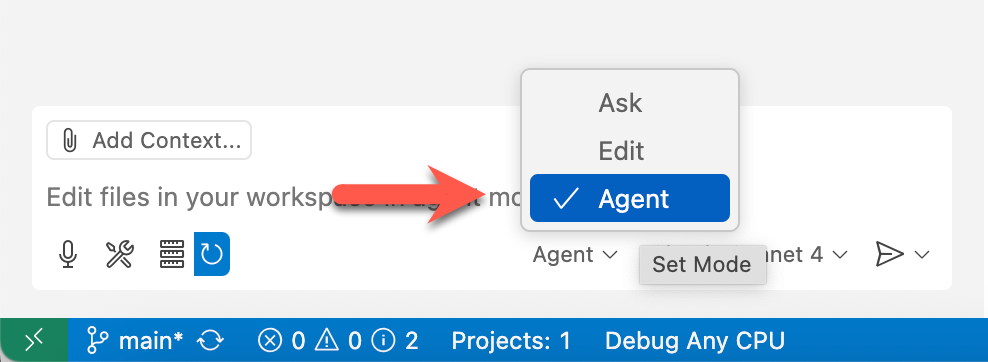

# 01: 使用 MCP 开发 Monkey 应用

在这一步中，您将使用 MCP 服务器构建一个简单的控制台应用程序。

## 先决条件

请参考 [README](../README.md#先决条件) 文档进行准备。

## 开始

- [检查 GitHub Copilot 代理模式](#检查-github-copilot-代理模式)
- [启动 MCP 服务器 – GitHub](#启动-mcp-服务器--github)
- [准备自定义指令](#准备自定义指令)
- [创建控制台应用程序](#创建控制台应用程序)
- [管理 GitHub 存储库](#管理-github-存储库)
- [启动 MCP 服务器 – Monkey MCP](#启动-mcp-服务器--monkey-mcp)
- [使用 GitHub Copilot 和 MCP 服务器开发 Monkey 应用](#使用-github-copilot-和-mcp-服务器开发-monkey-应用)

## 检查 GitHub Copilot 代理模式

1. 单击 GitHub Codespace 或 VS Code 顶部的 GitHub Copilot 图标并打开 GitHub Copilot 窗口。

   

1. 如果要求您登录或注册，请执行此操作。这是免费的。
1. 确保您正在使用 GitHub Copilot 代理模式。

   

1. 将模型选择为 `GPT-4.1` 或 `Claude Sonnet 4`。
1. 确保您已配置 [MCP 服务器](./00-setup.md#设置-mcp-服务器)。

## 启动 MCP 服务器 &ndash; GitHub

1. 通过按 `F1` 或在 Windows 上按 `Ctrl`+`Shift`+`P` 或在 Mac OS 上按 `Cmd`+`Shift`+`P` 打开命令面板，并搜索 `MCP: List Servers`。
1. 选择 `github` 然后单击 `Start Server`。您可能会被要求登录到 GitHub 以使用此 MCP 服务器。

## 准备自定义指令

1. 设置 `$REPOSITORY_ROOT` 环境变量。

   ```bash
   # bash/zsh
   REPOSITORY_ROOT=$(git rev-parse --show-toplevel)
   ```

   ```powershell
   # PowerShell
   $REPOSITORY_ROOT = git rev-parse --show-toplevel
   ```

1. 复制自定义指令。

    ```bash
    # bash/zsh
    cp $REPOSITORY_ROOT/docs/.github/monkeyapp-instructions.md \
       $REPOSITORY_ROOT/.github/copilot-instructions.md
    ```

    ```powershell
    # PowerShell
    Copy-Item -Path $REPOSITORY_ROOT/docs/.github/monkeyapp-instructions.md `
              -Destination $REPOSITORY_ROOT/.github/copilot-instructions.md -Force
    ```

1. 打开 `.github/copilot-instructions.md` 并将 `https://github.com/YOUR_USERNAME/YOUR_REPO_NAME` 替换为您的。例如，`https://github.com/octocat/monkey-app`。

## 创建控制台应用程序

1. 在 `workshop` 目录下创建控制台应用程序。

    ```bash
    # bash/zsh
    mkdir -p $REPOSITORY_ROOT/workshop
    cd $REPOSITORY_ROOT/workshop
    dotnet new console -n MyMonkeyApp
    ```

    ```powershell
    # PowerShell
    New-Item -Type Directory -Path $REPOSITORY_ROOT/workshop -Force
    cd $REPOSITORY_ROOT/workshop
    dotnet new console -n MyMonkeyApp
    ```

## 管理 GitHub 存储库

1. 向 GitHub Copilot 输入以下提示以推送创建的控制台应用程序。

    ```text
    将当前更改推送到存储库的 `main` 分支。
    ```

1. 向 GitHub Copilot 输入以下提示以在存储库上生成问题。

    ```text
    在我的存储库中创建一个新的 GitHub 问题，标题为"实现 Monkey 控制台应用程序"，包含以下要求：
    
    - 创建一个 C# 控制台应用程序，可以列出所有可用的猴子，按名称获取特定猴子的详细信息，并选择一个随机猴子。
    - 应用程序应使用 Monkey 模型类并包含 ASCII 艺术以增强视觉吸引力。
    - 添加适当的标签，如 'enhancement' 和 'good first issue'。
    - 添加一些关于我们如何实现这一点的详细信息以及我们需要做的事情的检查清单。
    ```

1. 将 `@Copilot` 分配给问题并观察发生的情况。

## 启动 MCP 服务器 &ndash; Monkey MCP

1. 通过按 `F1` 或在 Windows 上按 `Ctrl`+`Shift`+`P` 或在 Mac OS 上按 `Cmd`+`Shift`+`P` 打开命令面板，并搜索 `MCP: List Servers`。
1. 确保 `github` MCP 服务器正在运行。
1. 选择 `monkeymcp` 然后单击 `Start Server`。

## 使用 GitHub Copilot 和 MCP 服务器开发 Monkey 应用

1. 输入以下提示以获取猴子列表。

    ```text
    获取可用猴子的列表并在表格中显示它们的详细信息。
    ```

1. 输入以下提示以获得猴子数据模型的想法。

    ```text
    这种结构的数据模型会是什么样的？
    ```

1. 输入以下提示为数据模型类创建文件。

    ```text
    让我们为这个类创建一个新文件。
    ```

1. 输入以下提示创建 `MonkeyHelper` 类。

    ```text
    让我们创建一个名为 MonkeyHelper 的静态新类。它应该管理猴子数据的集合。包括获取所有猴子、获取随机猴子、按名称查找猴子以及跟踪选择随机猴子时的访问次数的方法。猴子的数据应该来自我们刚刚获得的 Monkey MCP 服务器。
    ```

1. 输入以下提示更新控制台应用程序。

    ```text
    现在让我们更新应用程序，使其具有一个漂亮的菜单，包含以下选项，这些选项将调用那个 `MonkeyHelper`。
    
    1. 列出所有猴子
    2. 按名称获取特定猴子的详细信息
    3. 获取随机猴子
    4. 退出应用程序

    还要随机显示一些有趣的 ASCII 艺术。
    ```

1. 向 GitHub Copilot 输入以下提示以推送更新的控制台应用程序。

    ```text
    将当前更改推送到存储库的 `mymonkeyapp` 分支。
    在推送更改之前，确保 `workshop` 目录包含在推送中。
    使用此分支，针对你的存储库的 `main` 分支创建 PR，而不是上游存储库。
    将此 PR 连接到之前创建的问题。
    然后，合并此 PR 并关闭问题。
    ```

---

OK. 您已经完成了"使用 MCP 开发 Monkey 应用"步骤。让我们继续进行 [步骤 02：MCP 服务器](./02-mcp-server.md)。

---

**免责声明**：本文档由 GitHub Copilot 进行本地化，可能包含错误或不准确之处。如果您发现任何问题，请通过 [GitHub Issues](https://github.com/Azure-Samples/mcp-workshop-dotnet/issues) 提供反馈。